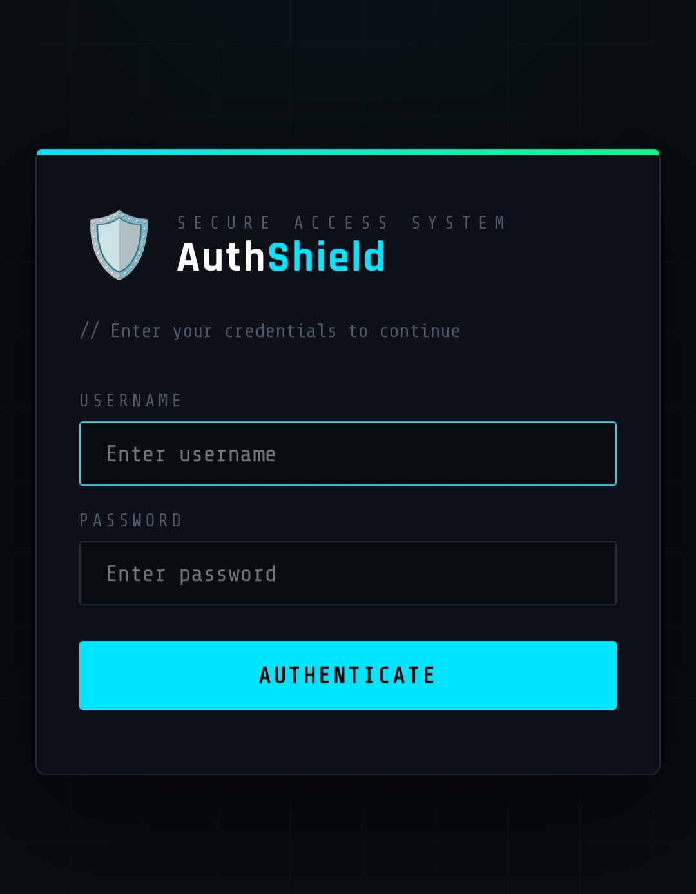
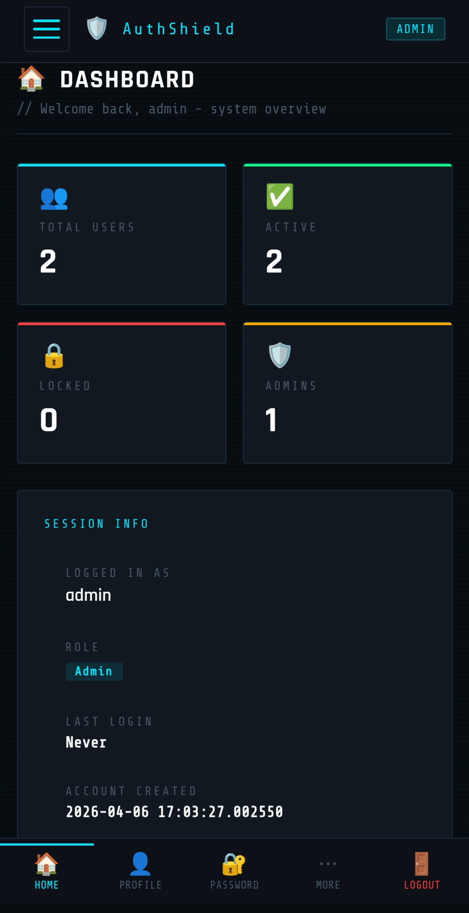
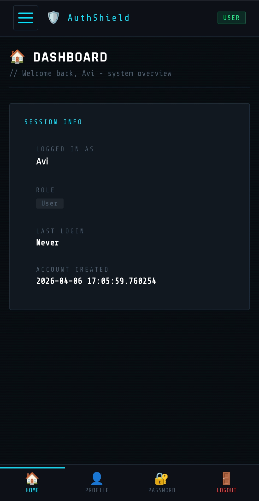

<html>
  <H1>🔐 AuthShield Access Control System</H1>

AuthShield is a secure web application built using Flask. It provides authentication, authorization, and admin-level user management  to ensure controlled access to system resources.

  
  <H1>🚀 Features</H1>  

▸ 🔑 Secure Login & Logout system

▸ 👥 Role-Based Access Control (Admin / User)

▸ 🛠️ Admin Dashboard to manage users

▸ 🔒 Account Locking after multiple failed attempts

▸ 🔓 Unlock locked user accounts (Admin only)

▸ 📊 Activity Logging system

  <H1>🧠 Technologies Used</H1>

 ▸ Backend: Python (Flask)

 ▸ Frontend: HTML, CSS

 ▸ Database: SQLite

 ▸ Deployment: Render

<H1>🛠️ Setup & Installation</H1>
Getting AuthShield running is straightforward.

1️⃣ Clone the repository
git clone 
https://github.com/avinashk08408/AuthShield-Access-Control-System.git  
cd AuthShield-Access-Control-System   
2️⃣ Install dependencies  
pip install -r requirements.txt  
3️⃣ Run the application  
python app.py  
4️⃣ Open in Browser 
Go to:
http://127.0.0.1:5000  
5️⃣ Default access 
Username: admin 
Password: Admin@123 
⚠️ Change the credentials after first login.

<H1>⚙️ How It Works</H1>
Login → Verification → Dashboard → Access Control → Monitoring → Logout  
 Login → User enters credentials 
Verification → System validates account & status 
Dashboard → Personalized interface is loaded  
Access Control → Features enabled based on privileges  
Monitoring → Tracks activity & handles failed attempts  
Logout → Session cleared securely  
A streamlined flow that ensures controlled access, continuous monitoring, and secure user interaction.

<H1>📸 System Preview</H1>

 Login page 📄 
   

  
 Admin Dashboard 📃
   

  
 User Dashboard 📃
  

   <H1>👀 Try it yourself</H1>   
Click here to view the project👇🏻<a href ="https://authshield-access-control-system-1.onrender.com" target= blank>https://authshield-access-control-system-1.onrender.com</a>

  <H1>📌 Future Enhancements</H1>
  ▸ PostgreSQL integration  
  ▸ Email verification system  
  ▸ API-based authentication  
  
  <H1> 👨‍💻 Author </H1>
Avinash K  
🔗 GitHub: https://github.com/avinashk08408 
🔗 Portfolio: https://avinashk08408.github.io  
⭐ If you found this project helpful, consider giving it a star on GitHub!
